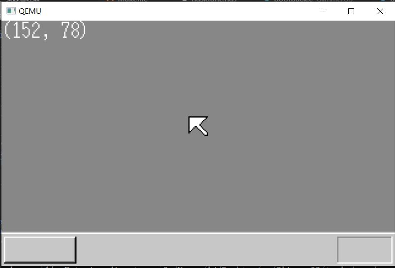

# GlimmerOS

The GlimmerOS is based on the book "30-day homemade operating system", drawing on many of its ideas, as well as the project[os-tutorial](https://github.com/cfenollosa/os-tutorial)

GlimmerOS是基于《30天自制操作系统》一书，借鉴其中很多思路方法和工具,以及项目[os-tutorial](https://github.com/cfenollosa/os-tutorial)

## 进程：

- 汇编阶段

  启动区等引入部分

- C阶段以及32位模式

  中断处理，鼠标控制等

未完仍然在开发学习中，更多开发可在[Glimmer](https://lj_evan.gitee.io/views/cs/os.html)

更多资料参考[https://github.com/yourtion/30dayMakeOS](https://github.com/yourtion/30dayMakeOS),[https://github.com/cfenollosa/os-tutorial](https://github.com/cfenollosa/os-tutorial)